# 音乐播放网站

#### 介绍
基于SpringBoot+Vue实现的音乐播放网站，分前后两端，不同的用户权限，后端主要是歌曲信息的管理，前台是歌曲播放。

#### 软件架构
前端：Vue | Element-ui  
后端：SpringBoot | Mybatis | mysql  
环境：JDK1.8 | Mysql | Maven   

#### 功能介绍
##### 【代码结构与数据库截图】
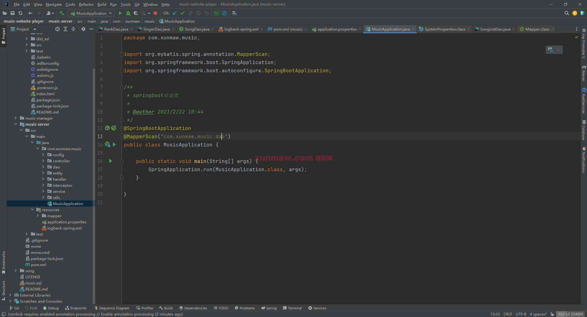
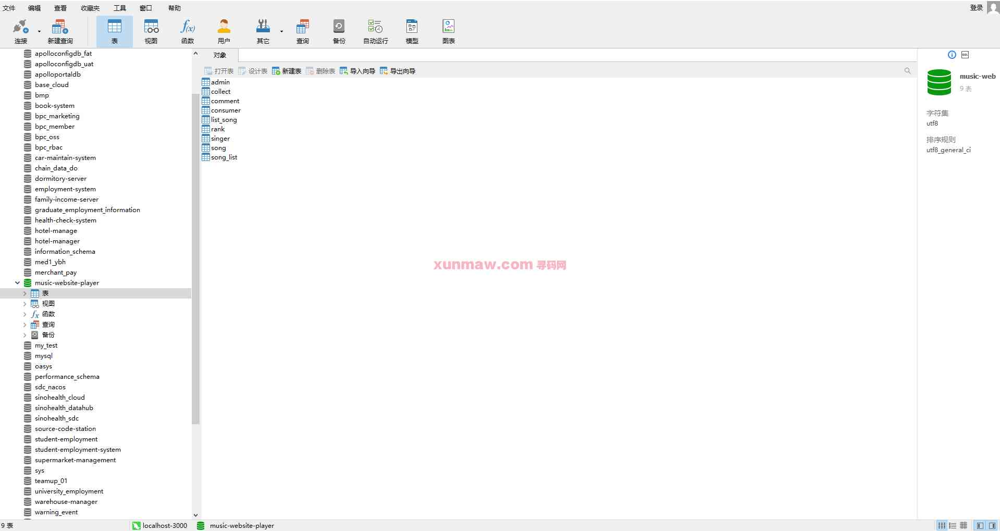

##### 【功能详述】 
1. 后端管理-登录页  
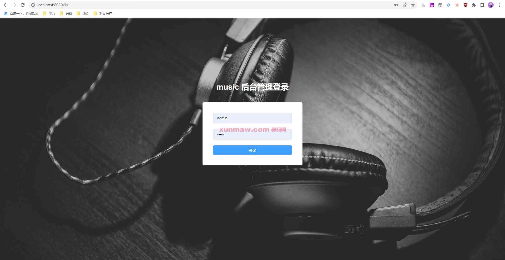

2.后端管理-首页  
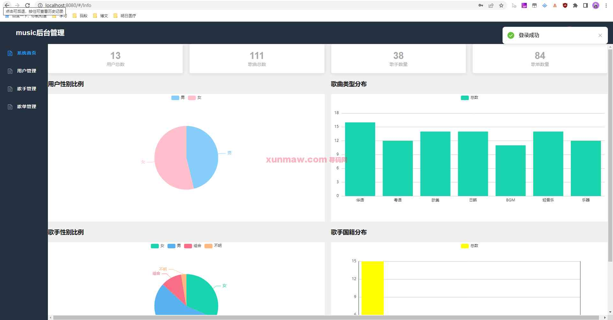

3.后端管理-用户管理  
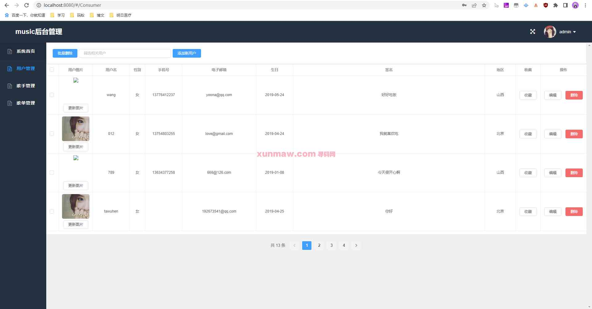

4.后端管理-歌手管理  
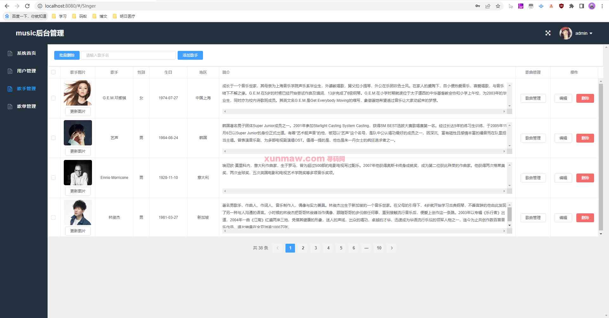

5.后端管理-歌单管理  
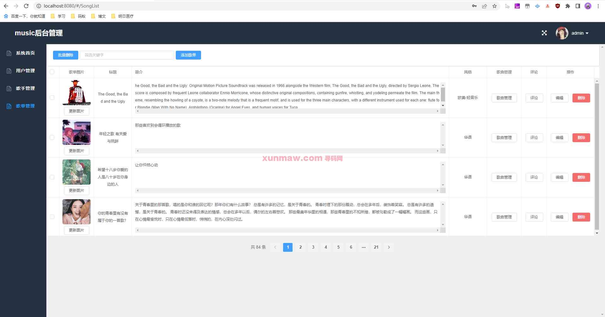

6.应用端-登录  
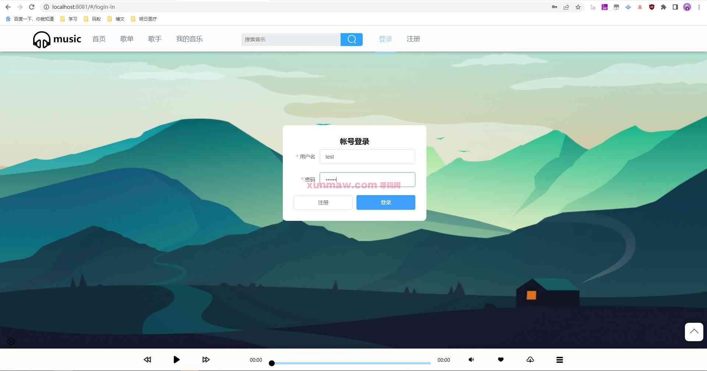

7.应用端-首页  
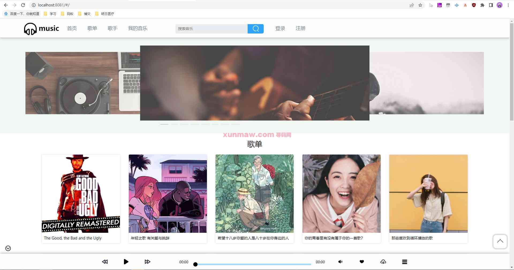

8.应用端-歌单页  
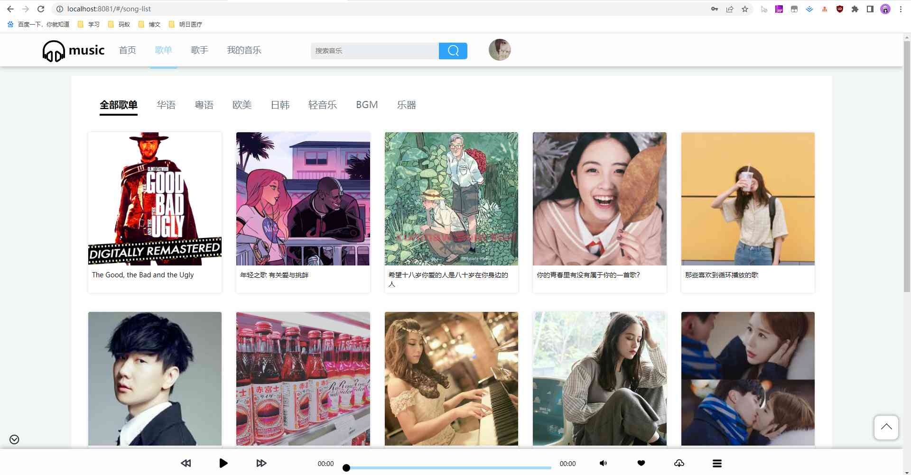

9.应用端-歌手页  
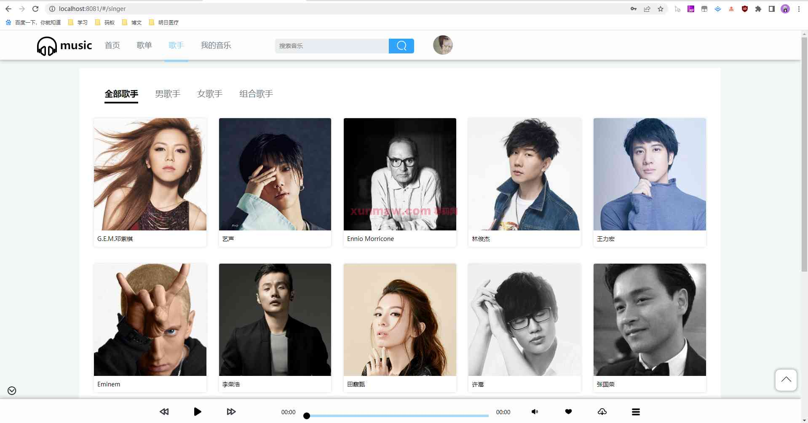

10.应用端-我的音乐  
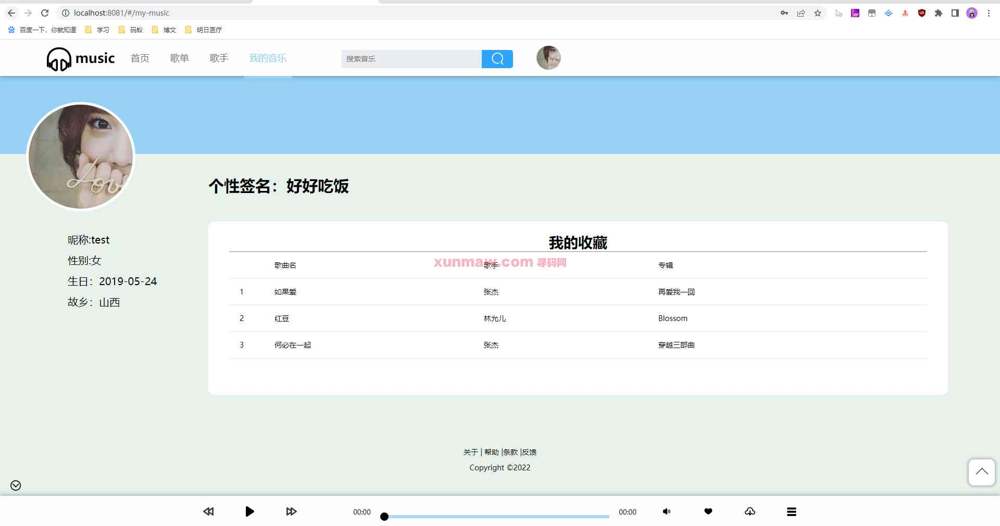

#### 使用说明
1. 创建数据库，执行数据库脚本
2. 修改jdbc数据库连接参数
3. 下载安装maven依赖jar
4. 启动SpringBoot启动类

后端管理： 
    请求地址： http://localhost:8080  
    用户名：admin    
    密码：123456    
应用端：  
    请求地址： http://localhost:8081  
    用户名：test  
    密码：123456  
